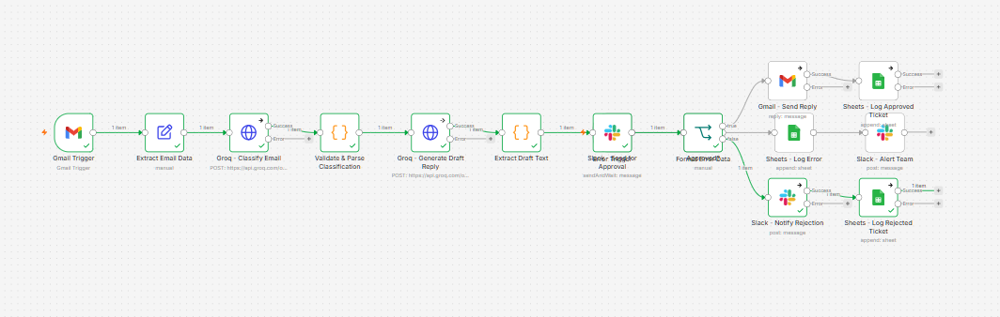
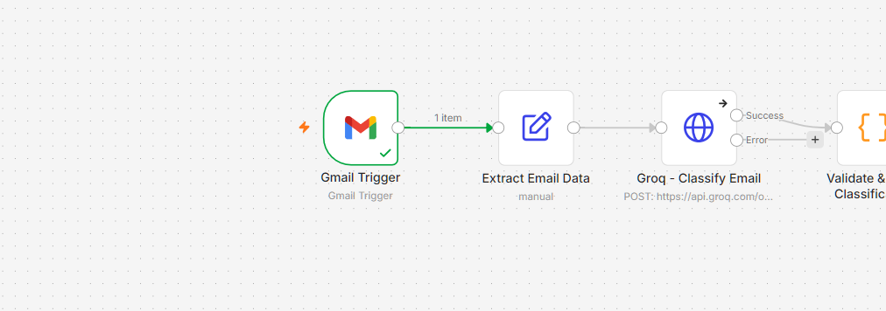
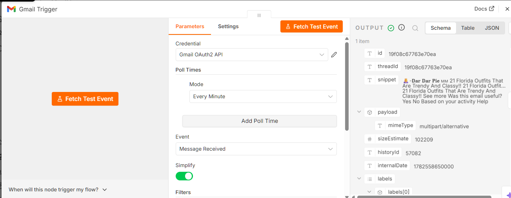
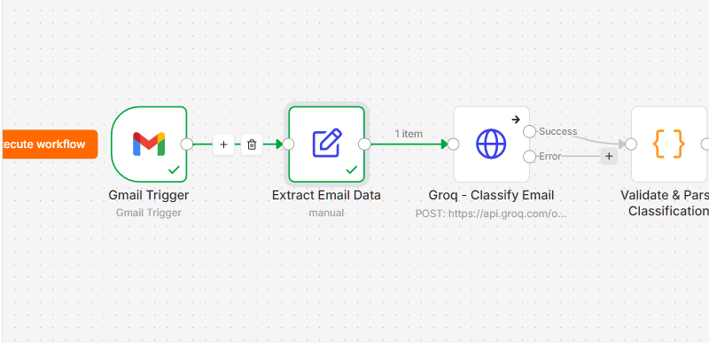
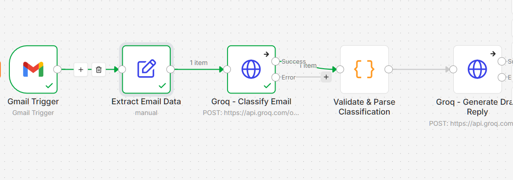
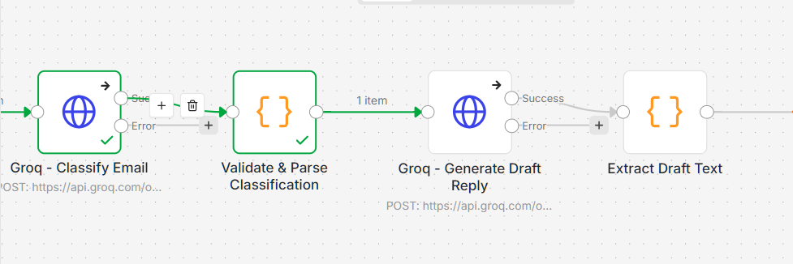
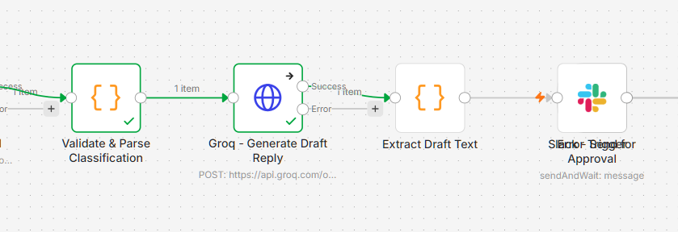
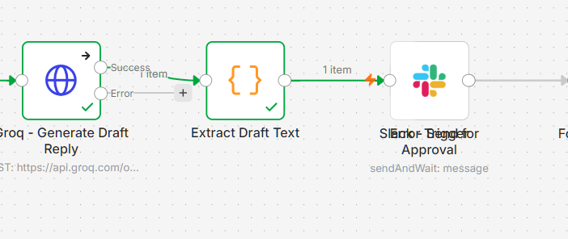
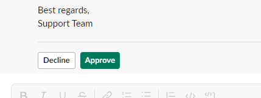
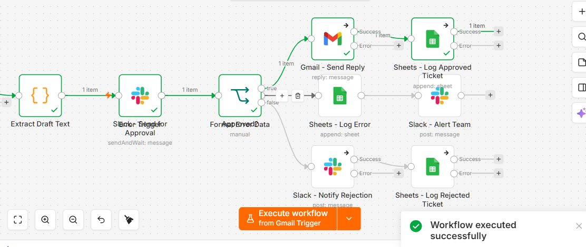

# AI Customer Support Ticket System

An n8n automation that reads incoming support emails from Gmail, classifies them and drafts a reply using Groq (`llama-3.1-8b-instant`), routes the draft through a Slack human-in-the-loop approval, and logs every ticket to Google Sheets — with retries, rate-limit handling, and a dedicated error-logging workflow.

Built as a portfolio project to demonstrate workflow automation, AI integration, multi-service API orchestration, and production-minded error handling — not just a "trigger calls API" demo.



## How it works

1. A new email lands in Gmail 
2. Sender name, email, subject, body, and timestamp are extracted and a unique ticket ID is generated
3. Groq analyzes the email and returns structured JSON: category, urgency, sentiment, and a summary
4. The AI response is validated before parsing — malformed or out-of-vocabulary values are caught and safely defaulted rather than crashing the run
5. Groq drafts a professional, empathetic reply under 150 words
6. The ticket and draft are posted to Slack for human approval, using n8n's native "Send and Wait for Approval" pattern (no custom webhook or polling loop)
7. **Approved** → the reply sends via Gmail as a threaded response, and the ticket is logged to Google Sheets
8. **Rejected** → the team is notified in Slack to edit and send manually, and the ticket is still logged for tracking
9. Any node failure anywhere in the pipeline (including exhausted Groq 429 retries) is caught by a separate Error Handler workflow, which logs it to an Error Log sheet and pages the team in Slack










## Tech stack

- **n8n** (self-hosted or n8n Cloud) — workflow orchestration
- **Groq API** (`llama-3.1-8b-instant`) — email classification and reply drafting
- **Gmail** — trigger + threaded reply sending
- **Slack** — human-in-the-loop approval + failure alerts
- **Google Sheets** — ticket log + error log

## Repo structure

```
ai-support-ticket-system/
├── workflows/
│   ├── AI-Support-Ticket-System.json        # main workflow
│   └── AI-Support-Ticket-Error-Handler.json # error handling workflow
├── docs/
│   ├── architecture-diagram.png
│   └── screenshots/
├── .env.example
└── README.md
```

## Setup

### 1. Prerequisites
- n8n instance (self-hosted or n8n Cloud)
- [Groq API key](https://console.groq.com)
- Gmail account with OAuth2 access
- A Slack workspace + bot token (scopes: `chat:write`, `channels:read`)
- A Google Sheet with two tabs: `Tickets` and `Error Log`

### 2. Import the workflows
In n8n: **Workflows → Import from File**
- Import `AI-Support-Ticket-Error-Handler.json` first
- Then import `AI-Support-Ticket-System.json`
- In the main workflow's **Settings → Error Workflow**, select the error handler

### 3. Set up credentials
Credentials are never included in exported workflow JSON — you'll need to create these fresh in n8n and attach them to each node:

| Credential | Type | Notes |
|---|---|---|
| Groq | Header Auth | Header name `Authorization`, value `Bearer YOUR_GROQ_KEY` |
| Gmail | Gmail OAuth2 | Standard Google Cloud OAuth setup |
| Slack | Slack API (Bot token) | Invite the bot to your approval + alert channels |
| Google Sheets | Google Sheets OAuth2 | Same Google Cloud project as Gmail |

### 4. Configure environment values
Copy `.env.example`, fill in your real values, and either export them on your n8n host or paste them directly into the relevant node fields:
```
GOOGLE_SHEET_ID=your_google_sheet_id_here
SLACK_APPROVAL_CHANNEL=support-approvals
SLACK_ALERT_CHANNEL=support-alerts
```

### 5. Google Sheet structure

**`Tickets` tab:**
```
Ticket ID | Date | Customer Name | Customer Email | Subject | Category | Sentiment | Urgency | AI Summary | Draft Response | Response Status | Final Response | Resolution Date
```

**`Error Log` tab:**
```
Error ID | Timestamp | Workflow | Failed Node | Error Message | Is Rate Limit | Execution URL
```

### 6. Test and activate
Send a test email to the connected inbox, run the workflow, and approve/reject the Slack prompt to confirm both branches complete. Once confirmed, activate the workflow to start live polling.

## Error handling

- Every Groq HTTP call retries automatically on failure (4 attempts, 3s apart) to absorb transient 429 rate limits
- Failed calls route to a dedicated error output instead of silently stalling
- A separate Error Handler workflow catches any failure across the whole pipeline, logs it to the `Error Log` sheet, and posts a Slack alert with a link to the failed execution

## Challenges solved while building this

A few real issues worth mentioning since they came up during actual development, not just design:

- **Gmail's raw vs. simplified payload format** — sender/subject fields live in a `payload.headers` array (with capitalized keys like `From`, `Subject`) rather than flat fields, depending on trigger settings
- **JSON-escaping conflicts inside n8n expressions** — nesting `.replace()` calls with escaped quotes inside a JSON request body breaks the expression parser; solved by pre-cleaning text fields (`subjectSafe`, `bodySafe`) upstream instead of inline
- **Diagnosing a 401 across two layers** — isolating whether an API failure was n8n's credential wiring or the key itself by testing the same key directly against Groq's API outside of n8n
- **Cross-node data references** — once an item passes through a node like Slack, `$json` refers to that node's output, not the original ticket data; fixed with explicit `$('Node Name').item.json.field` references
- **Slack's approval buttons require explicit configuration** — the "Send and Wait" node doesn't show a Reject button until you add it under Approval Options

